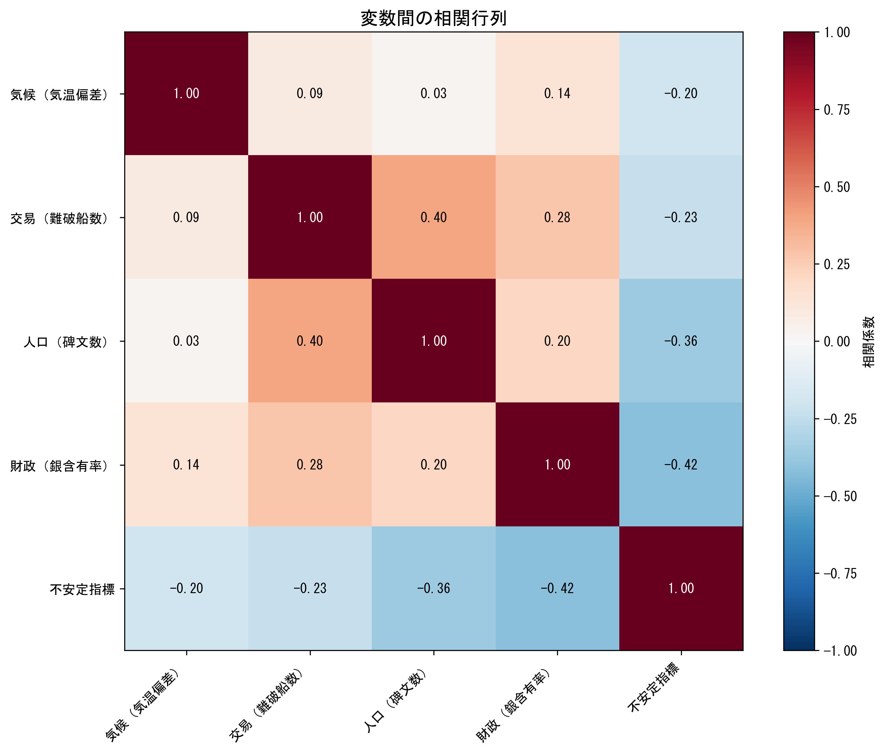

# クリオダイナミクスを用いたローマ帝国衰退の数理モデリング

**— 因果連鎖分析による3世紀の危機の検証 —**

東京農工大学 農学部 地域生態システム学科 卒業論文（2026年3月）

## 概要

ローマ帝国「3世紀の危機」（235-284年）における衰退メカニズムを、**クリオダイナミクス**（歴史動力学）の手法で定量的に分析した研究です。

従来の歴史学では個別要因（気候変動、疫病、軍事的要因など）が別々に論じられてきましたが、本研究ではこれらを **因果連鎖モデル** として統合し、統計的に検証しました。

### 検証した因果連鎖

$$\text{気候} \rightarrow \text{交易/農業} \rightarrow \text{人口} \rightarrow \text{財政} \rightarrow \text{政治不安定}$$

### 分析手法

- **グレンジャー因果性検定**: 各因果関係の方向性と有意性を統計的に検定
- **ロトカ・ヴォルテラモデル**: Roman & Palmer (2019) を参考に、軍隊規模・領土・貨幣品位の動態をシミュレーション
- **相互相関分析**: 変数間の時間遅れ構造を解析

## 分析結果

因果連鎖変数の時系列推移（ピンク領域が「3世紀の危機」）：




### 主要な発見

- **気候→交易** 間に統計的に有意な因果関係を確認（p=0.003）
- **財政→政治不安定** 間の因果関係も有意（p=0.020）
- 3世紀の危機期間中、銀含有率が98%から4%へ暴落する過程と政治不安定の連動を定量的に示した

## 使用技術

| カテゴリ | 技術 |
|---------|------|
| 言語 | Python 3.10+ |
| データ処理 | Pandas, NumPy, OpenPyXL, PyArrow |
| 統計分析 | SciPy, statsmodels (Granger因果性, VARモデル) |
| 可視化 | Matplotlib, Seaborn |
| ノートブック | Jupyter Notebook |
| 発表資料 | Marp (Markdown), LaTeX |

## プロジェクト構造

```
graduation-thesis/
├── src/
│   ├── config.py                 # パラメータ設定・皇帝データ・分析期間定義
│   ├── data_loader.py            # 5種類のプロキシデータの読み込み・前処理
│   ├── lotka_volterra.py         # ロトカ・ヴォルテラモデル（帝国動態シミュレーション）
│   ├── causal_analysis.py        # 因果連鎖分析（グレンジャー検定・相互相関）
│   ├── visualization.py          # 分析結果の可視化
│   └── plot_significant_results.py  # 有意な因果関係の可視化
├── data/                         # 分析データ（銀貨・気候・難破船・碑文・政治不安定）
├── notebooks/
│   ├── analysis.ipynb            # 銀貨成分分析ノートブック
│   └── causal_chain_analysis.ipynb  # 因果連鎖分析ノートブック
├── outputs/figures/              # 出力図（6種類の分析結果）
├── docs/                         # 分析手法・データソース等のドキュメント
├── image/                        # 発表用画像素材
├── slide.md                      # 発表スライド（Marp形式）
├── slides.tex                    # 発表スライド（LaTeX版）
├── slide.pdf                     # 発表スライド（PDF）
└── requirements.txt              # Python依存パッケージ
```

## データソース

本研究では以下の5種類のプロキシデータを統合して分析しました：

| 指標 | データソース | 代理変数 |
|------|------------|---------|
| 気候 | 欧州夏季気温復元データ (NOAA) | 気温変動 |
| 交易/農業 | 地中海難破船データベース (Strauss) | 海上交易量 |
| 人口 | ラテン碑文データベース (LIST v1.2) | 碑文出土数 |
| 財政 | ローマ銀貨成分分析データ | 銀含有率 |
| 政治不安定 | Seshat歴史データベース | 不安定指数 |

## 実行方法

### 環境構築

```bash
git clone https://github.com/ToYamane/graduation-thesis.git
cd graduation-thesis
pip install -r requirements.txt
```

### 分析の実行

```bash
# Jupyter Notebook で対話的に分析
jupyter notebook notebooks/causal_chain_analysis.ipynb

# コマンドラインから因果連鎖分析を実行
python -m src.causal_analysis

# 有意な結果の可視化
python -m src.plot_significant_results
```

## 参考文献

- Roman, S., & Palmer, E. (2019). *The Growth and Decline of the Western Roman Empire: Quantifying the Dynamics of Army Size, Territory, and Coinage.*
- Turchin, P. (2003). *Historical Dynamics: Why States Rise and Fall.* Princeton University Press.
- Harper, K. (2017). *The Fate of Rome: Climate, Disease, and the End of an Empire.* Princeton University Press.
