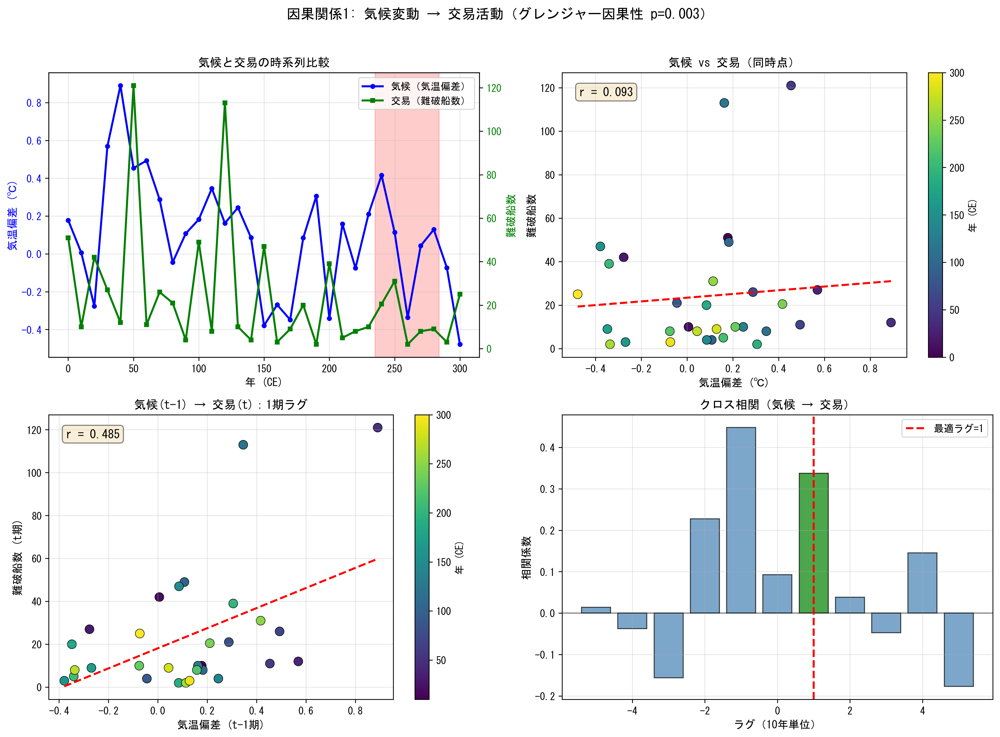
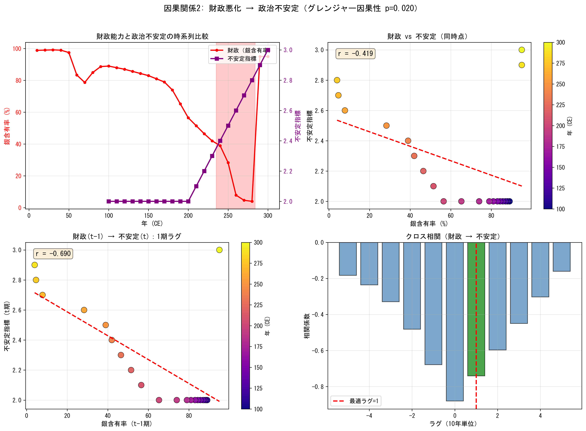
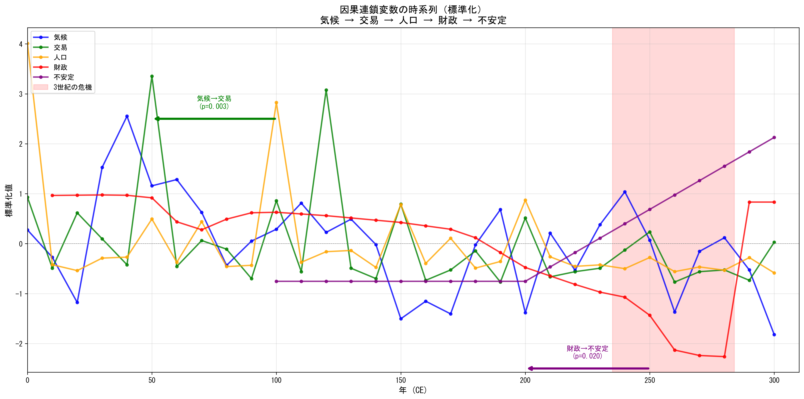

# クリオダイナミクスを用いた<br>ローマ帝国衰退の数理モデリング
## - 因果連鎖分析による3世紀の危機の検証 -

<br>

### 東京農工大学 環境哲学4年
### 山根 聡展

---

# 本日の流れ

1. 背景・問題設定（3世紀の危機）
2. 研究問い／仮説
3. **思想的背景（環境決定論・環境史学）**
4. 先行研究（クリオダイナミクス・SDT・従来説）
5. 本研究の独自性
6. データと観測指標
7. 分析手法と検証結果
8. 考察と今後の課題

---

# 研究背景

## 歴史学における課題
- 文献史学による定性的な解釈が主流
- 複雑な因果関係の客観的な検証が困難

## 本研究の目的
- **クリオダイナミクス**（歴史動力学）の手法を導入
- ローマ帝国の衰退過程を統計的に検証可能な形で分析
- 特に「3世紀の危機」における崩壊メカニズムを検証

---

# 3世紀の危機（235-284年）

- 政治的混乱・経済破綻・外敵侵入が複合し、帝国が崩壊の瀬戸際に瀕した時期

**本研究で検証する観点**
1. **気候変動**（245-275年の寒冷化）
2. **交易・農業生産力の低下**（難破船数の減少）
3. **人口減少**（キプリアヌスの疫病 249-262年）
4. **財政悪化**（銀含有率 98%→4.5%に暴落）
5. **政治的不安定**（50年間で26人の皇帝が乱立）


---

# 研究仮説：因果連鎖モデル

**主仮説**：気候変動による農業生産力の低下が、人口と国家財政を通じて不安定化を増幅し、3世紀の危機の政治的混乱を説明できるのか。

**検証する因果連鎖**

$$\text{気候} \rightarrow \text{交易/農業} \rightarrow \text{人口} \rightarrow \text{財政} \rightarrow \text{政治不安定}$$

**思想的着眼点**：因果連鎖の起点が気候（自然）であること
→ 歴史の営みは人間による偶然ではなく、自然の理に規定されている

**検証方法**：グレンジャー因果性検定
- 「XがYを予測するか」を統計的に検定
- 各矢印（因果関係）の有意性を 相関係数pで評価

---

# 思想的背景：環境決定論と環境史学

## 環境決定論（モンテスキュー）
- 『法の精神』(1748)：気候・地理が社会制度や法を規定する
- 「自然が人間社会の形を決める」という視座の先駆け

## 環境史学（20世紀後半〜）
- 自然環境と人間社会の相互作用を歴史的に分析
  - ダイアモンド『銃・病原菌・鉄』(1997)/ Harper『ローマの運命』(2017)

## 本研究の位置づけ
環境決定論の発想 + クリオダイナミクスの統計的手法
→ 「環境が歴史を規定する」仮説をデータで検証

---

# クリオダイナミクス（歴史動力学）とは

## 定義
- 歴史（Clio）+ 力学（Dynamics）
- 歴史ビッグデータに数理科学的アプローチを適用する学際分野

## 従来の手法との違い

| 特徴 | 従来の歴史学 | クリオダイナミクス |
| :-: | :--- | :--- |
| **手法** | 文献に基づく定性的解釈 | **データと統計による定量的分析** |
| **目的** | 「物語（ナラティブ）」の構築 | **「メカニズム」の解明・検証** |
| **検証** | 史料批判（主観が入りやすい） | **統計的検定・因果推論** |

---

# 構造的デモグラフィ理論 (SDT)

ピーター・ターチン(Peter Turchin)らが提唱。

1. **人口増加** → 労働供給過多 → 賃金低下
2. **エリート過剰生産** → 富の集中 → ポスト争いの激化
3. **国家の財政破綻** → 内部対立による機能不全

**本研究との接続**：
- SDTの発想を参考に、**気候→農業→人口→財政→不安定**の経路を検証
- ただし「エリート過剰生産」は検証対象外

---

# 3世紀の危機に関する従来説

| 従来説 | 主な主張 | 代表的研究者 |
|:------:|:---------|:-------------|
| 気候変動説 | 寒冷化が農業衰退を招いた | Harper (2017) |
| 疫病説 | キプリアヌスの疫病が人口激減 | Harper (2017) |
| 軍事的要因説 | 外敵侵入と内戦が主因 | Goldsworthy |
| 財政破綻説 | 通貨改悪とインフレが崩壊を招いた | Butcher & Ponting |

**課題**：各説が個別要因に注目し、因果連鎖として検証されていない

---

# 本研究の位置づけと独自性

## 先行研究の課題
- 個別要因の記述的分析が主流
- 因果関係の方向性が検証されていない
- 複数要因の連鎖的影響が未検証

## 本研究の独自性
1. **因果連鎖モデル**：気候→交易→人口→財政→不安定を一連の経路として検証
2. **統計的検証**：グレンジャー因果性検定による方向性の確認
3. **複数データの統合**：5種類の異なるプロキシを組み合わせた分析

---

# 使用データ

| 変数 | プロキシ（代理指標） | データソース | URL |
|:----:|:-------------------|:-------------|:---:|
| 気候 | 夏季気温偏差 | Luterbacher et al. (2016) | [DOI](https://doi.org/10.1088/1748-9326/11/2/024001) |
| 交易/農業 | 難破船数 | OXREP Shipwrecks Database | [Link](https://oxrep.classics.ox.ac.uk/databases/shipwrecks_database/) |
| 人口 | 碑文数 | LIST Dataset (525,870件) | [Zenodo](https://doi.org/10.5281/zenodo.8415712) |
| 財政 | 銀含有率 | Butcher & Ponting (2015) | [Cambridge](https://doi.org/10.1017/CBO9781139048620) |
| 不安定 | 政治不安定指標 | Seshat Equinox Dataset | [Zenodo](https://doi.org/10.5281/zenodo.6623522) |

**分析期間**：AD 1年 〜 300年（10年単位で集計）

<style scoped>
section { font-size: 26px; }
table { width: 100%; font-size: 22px; }
th, td { padding: 8px 12px; }
</style>

---

# データソース詳細

### 1. 気候データ
- **Luterbacher et al. (2016)** "European summer temperatures since Roman times"
- 期間: 138 BCE - 2003 CE、年単位解像度

### 2. 難破船データ（OXREP）
- 1,784件の地中海難破船データ
- 交易活動の代理指標

### 3. 碑文データ（LIST Dataset）
- 525,870件のラテン語碑文
- 人口・経済活動の代理指標

---

# 分析手法

## グレンジャー因果性検定
- 「変数Xの過去値が、変数Yの予測に寄与するか」を検定
- 帰無仮説：XはYをグレンジャー原因しない
- **p < 0.05** で因果関係ありと判定

## 検証する因果関係
1. 気候 → 交易
2. 交易 → 人口
3. 人口 → 財政
4. 財政 → 不安定

---

# 検証結果：グレンジャー因果性検定

| 原因 | 結果 | p値 | 判定 |
|:----:|:----:|:---:|:----:|
| **気候** | **交易** | **0.003** | **有意 ○** |
| 交易 | 人口 | 0.464 | 非有意 × |
| 人口 | 財政 | 0.885 | 非有意 × |
| **財政** | **不安定** | **0.020** | **有意 ○** |

**結果**：因果連鎖の**最初と最後のステップ**が統計的に支持された

$$\text{気候} \xrightarrow{p=0.003} \text{交易} \rightarrow \text{人口} \rightarrow \text{財政} \xrightarrow{p=0.020} \text{不安定}$$

---

# 因果関係1：気候 → 交易



---

# 気候→交易の解釈

- **左上**：気候（青）と交易（緑）の時系列。赤い領域は3世紀の危機
- **右上**：散布図。弱い正の相関（r=0.093）
- **左下**：1期ラグ付き散布図（r=0.485）
  - 気候変動が10年後の交易活動に影響
- **右下**：クロス相関。ラグ1（10年）で最大相関

**解釈**：気候変動が交易活動（農業生産力の代理指標）に
**10年のタイムラグ**で影響を与えている

---

# 因果関係2：財政 → 不安定



---

# 財政→不安定の解釈

- **左上**：銀含有率（赤）と不安定指標（紫）の時系列
  - 3世紀に銀含有率が急落し、同時期に不安定が上昇
- **右上**：散布図（r=-0.419）。負の相関
- **左下**：1期ラグ付き散布図（r=-0.690）
  - 財政悪化が10年後の政治不安定を予測
- **右下**：クロス相関。全てのラグで負の相関

**解釈**：銀含有率の低下（財政悪化）が政治不安定に
**10年のタイムラグ**で先行している

---

# 因果連鎖の全体像



---

# 結果のまとめ

## 支持された因果関係
1. **気候変動 → 交易活動**（p=0.003）
   - 気候の変化が10年後の交易（農業生産力）に影響
2. **財政悪化 → 政治不安定**（p=0.020）
   - 銀含有率の低下が10年後の政治不安定を予測

## 中間の連鎖（交易→人口→財政）
- 統計的に有意ではなかった
- データ数（31観測）の制約による検出力の限界の可能性

---

# 考察：因果連鎖の部分的支持

**本分析で判明したこと**

```
気候 ──→ 交易 ─ ─ → 人口 ─ ─ → 財政 ──→ 不安定
     有意         非有意       非有意      有意
   (p=0.003)                           (p=0.020)
```

- 因果連鎖の起点（気候→交易）と終点（財政→不安定）は統計的に支持
- 中間経路は、より精緻なデータや異なる手法で再検証が必要

---

# 分析の限界

1. **データの解像度**
   - 10年単位の集計により、短期的な変動が平滑化
   - Seshatデータは100年単位（200年, 300年のみ）

2. **代理指標の限界**
   - 難破船数 ≠ 農業生産力（直接指標ではない）
   - 碑文数 ≠ 人口（保存バイアスの可能性）

3. **外生ショック**
   - キプリアヌスの疫病（AD249-262）の独立した効果
   - 外敵侵入などの軍事的要因

---

# 今後の課題

### 1. データの拡充
- より高解像度の気候データの探索
- 地域別の分析（イタリア、ガリア、エジプト等）

### 2. 手法の改善
- VARモデルによる同時方程式分析
- 非線形モデル（閾値効果）の検討

### 3. 対立仮説との比較
- 疫病主導モデルとの比較検証
- 外敵圧力モデルとの比較検証

---

# 結論

**問い**：気候変動→農業→人口→財政→不安定の連鎖は3世紀の危機を説明できるか？

**回答**：
- 連鎖の一部が統計的に支持された
  - 気候変動 → 交易活動（p=0.003）
  - 財政悪化 → 政治不安定（p=0.020）
- 完全な連鎖の検証には、より精緻なデータと分析が必要

**意義**：歴史的事象に対する統計的因果推論の適用可能性を示した

---

# 参考文献

- Peter Turchin. *Historical Dynamics: Why States Rise and Fall*. Princeton, 2003.
- Peter Turchin. "Arise 'cliodynamics'." *Nature* 454, 2008.
- Luterbacher, J. et al. "European summer temperatures since Roman times." *Environmental Research Letters*, 2016.
- Butcher & Ponting. *The Metallurgy of Roman Silver Coinage*. Cambridge, 2015.
- Seshat Global History Databank. Equinox Dataset. Zenodo, 2022.
- OXREP Shipwrecks Database. Oxford Roman Economy Project.
- LIST Dataset. Latin Inscriptions Structured Text. Zenodo, 2024.

<style scoped>
section { font-size: 20px; }
</style>
